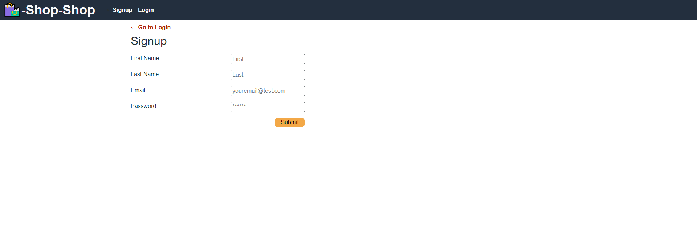

  # Redux

  

  ## Description
  
  An example of use of `redux` instead of the context-API

  ## Table of Contents
  
  * [Installation](#installation)
  * [Usage](#usage)
  * [Contributing](#contributing)
  * [Tests](#tests)
  * [Questions](#questions)
  
  ## Installation
  
  This program is built upon React, with use of Mongo through mongoose, local redux, and a few other dependencies

  ## Usage
  
  Demonstrates ability to understand state. Had difficulty getting images to load again for some reason, submitting now to get graded on time. Login/Create user work perfectly with Redux state, user remains logged in as well. Shop function seem to be broken for some reason, unrelated to Redux itself. Might be an issue with Heroku.

  ## Contributing
  
  No contributors at this time.

  ## Tests
  
  No collaborators at this time.

  ## Questions
  
  Reach out to me at the links below with any questions, comments, or concerns:

  GitHub: [adamlsn](https://github.com/adamlsn) 
  email: [adamlsn@gmail.com](mailto:adamlsn@gmail.com)
  